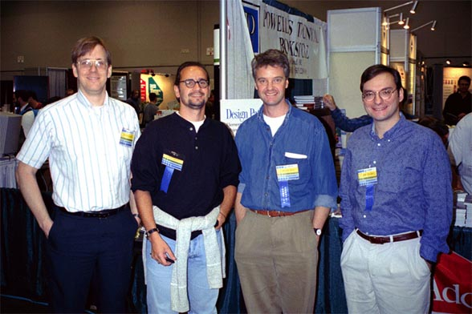
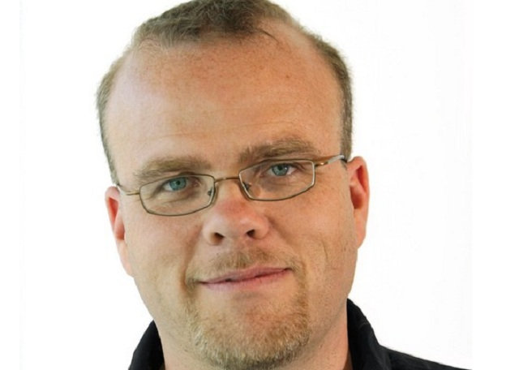
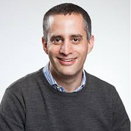

## PPP (Principles, Patterns and Proposals)
#### SOLID principles, GOF patterns and PSR's proposals (and tests by using TDD and BDD aprouch)

**This project is under development** 

**Everything is being implemented by using SOLID principles, GOF patterns, FIG proposals (PSR's), TDD and BDD approach**

The objective is implement something simple, but useful and respecting the conventions. **Bower** manager package used to manage packages and composer to manage dependencies. The logger interface was made using **PSR-3** proposals and autoload using **PSR-4**. There is some samples of using stream, stream wrapper for session and data storage and, of course, to test http requisitions. All the code was tested using **TDD** approach and **PHPUnit Framework**. JS script was tested too, by using **Jasmine Framework**. Project code has been documented by using **phpDocumentor**.

**Composer**
> composer create-project mallon/ppp

*by Thiago Mallon*

