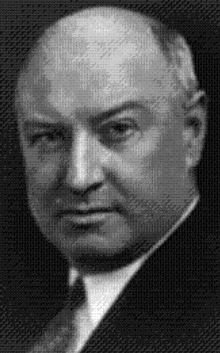

## PPP (Principles, Patterns and Proposals)
#### SOLID, DRY and KISS principles, Design Patterns and PSR's proposals

**This project is under development**

**Everything is being implemented by using SOLID, DRY and KISS principles, Design Patterns, FIG proposals (PSR's), TDD and BDD approach.**

The objective is to implement something simple, but useful and respecting the conventions. It's being used **bower** and **composer** to manage package and dependencies, respectively. **PSR-1** and **PSR-2** for code conventions and style, **PSR-3** for logger interface and **PSR-4** for autoloading. It's being used stream wrappers for session storage, temporary data storage and to test http requisitions. All of the code is being developed by following the **TDD** approach with **PHPUnit Framework**. **JS** scripts is being tested, by implementing **BDD** approach with **Jasmine Framework**. Project code is being documented by using **phpDocumentor**.

**Composer**
> composer create-project mallon/ppp

> "We're looking for more of a key-turn manager." - Jim Farley

*by Thiago Mallon*
